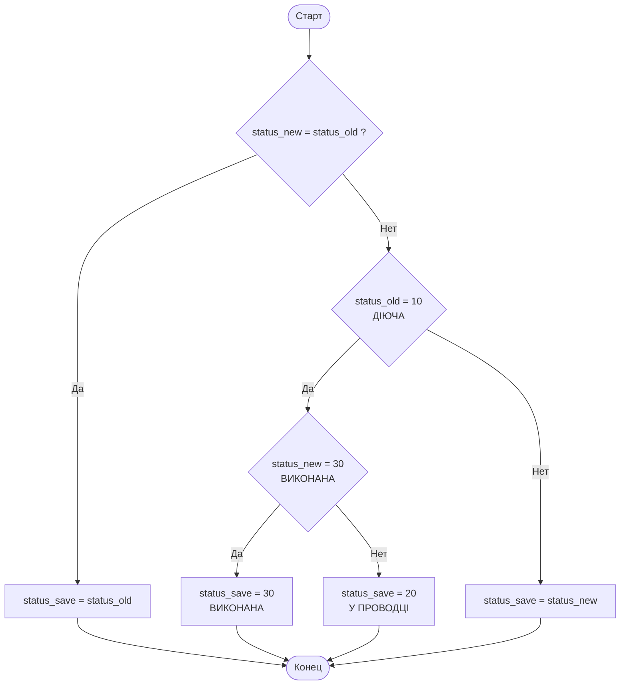

# ПЛС ЧЕРНОМОРСК
<span class="quick-highlight date">2025-08-01</span> стартовала опытная экслуатация в ПЛС Черноморск

## Проводки ЛС
<!-- 
__Таблица__ со _списком_ проводок **почти** ```такая``` же *как* на $Дунае$
_фыввыфа_

- ==Важно=={.quick-highlight.important}  
- ==Ошибка=={.quick-highlight.danger}  
- success{.quick-highlight.success}  
- warning{.quick-highlight.warning}  
- `ДЕЙСТВУЮЩЕЙ`{.quick-highlight.stat_die}  
- `В ПРОВОДКЕ`{.quick-highlight.stat_prov}  
- `ВЫПОЛНЕНА`{.quick-highlight.stat_vik}  

<span class="quick-highlight important">Важно</span>  
<span class="quick-highlight danger">Ошибка</span>  
<span class="quick-highlight success">Успех</span>  
<span class="quick-highlight warning">Внимание</span>  
<span class="quick-highlight stat_die">ДЕЙСТВУЮЩЕЙ</span>  
<span class="quick-highlight stat_prov">В ПРОВОДКЕ</span>  
<span class="quick-highlight stat_vik">ВЫПОЛНЕНА</span>  


- <span class="quick-highlight important">Важно</span>: Номер квитанции по формату ГГ012345
- <span class="quick-highlight danger">Ошибка</span>: Можно ввести некорректное значение
- <span class="quick-highlight success">Успех</span>: Автоматическая генерация прошла


| Статус | Описание |
|--------|----------|
| <span class="quick-highlight stat_die">ДЕЙСТВУЮЩЕЙ</span> | Заявка активна |
| <span class="quick-highlight stat_prov">В ПРОВОДКЕ</span> | Проводка выполняется |
| <span class="quick-highlight stat_vik">ВЫПОЛНЕНА</span> | Заявка завершена |


Пример списка:

- Номер квитанции по формату ГГ012345
- Но можно вводить свободно
- И есть автоматическая генерация при вводе времени прибыл
- Или по кнопке можно сгенерировать


Пример нумерованного списка:

1. Диспетчер принимает заявки
2. Диспетчер отмечает планируемые заявки 
3. Диспетчер может назначять лоцманов в заявки
4. И такми образом формируется состав работ, который можно посмотреть в режиме ПЕРГЛЯД ЗАЯВОК

[Ссылка на главную страницу](index.md)
 -->
### Форма ввода
Отличительная особенность от формы ввода на Дунае в том, что при сохранении проводки статус заявки автоматически меняется из `ДЕЙСТВУЮЩЕЙ` на `В ПРОВОДКЕ` 
> В данном разделе будем публиковать инструкции к новым режимам на сайте 

# Таблица переходов значений статусов
| Было (status_old) | Новый (status_new) | Итог (status_save) | Комментарий                |
|-------------------|--------------------|---------------------|----------------------------|
| 10 (действ.)      | 10 (ДІЕ)           | 10 (ДІЕ)            | Не меняли (ДІЕ)            |
| 10 (действ.)      | 20 (У ПРОВ)        | 20 (У ПРОВ)         | Переводим в "в проводке"   |
| 10 (действ.)      | 30 (ВИК)           | 30 (ВИК)            | Сразу в "выполнена" (ВИК)  |
| 20 (в проводке)   | 20 (У ПРОВ)        | 20 (У ПРОВ)         | Не меняли (У ПРОВ)         |
| 20 (в проводке)   | 10 (ДІЕ)           | 10 (ДІЕ)            | Сохраняем выбранный (ДІЕ)  |
| 20 (в проводке)   | 30 (ВИК)           | 30 (ВИК)            | Сохраняем выбранный (ВИК)  |
| 30 (выполнена)    | 30 (ВИК)           | 30 (ВИК)            | Не меняли (ВИК)            |
| 30 (выполнена)    | 10 (ДІЕ)           | 10 (ДІЕ)            | Сохраняем выбранный (ДІЕ)  |
| 30 (выполнена)    | 20 (У ПРОВ)        | 20 (У ПРОВ)         | Сохраняем выбранный (У ПРОВ)|
# Алгоритм смены статусов

