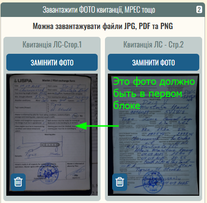
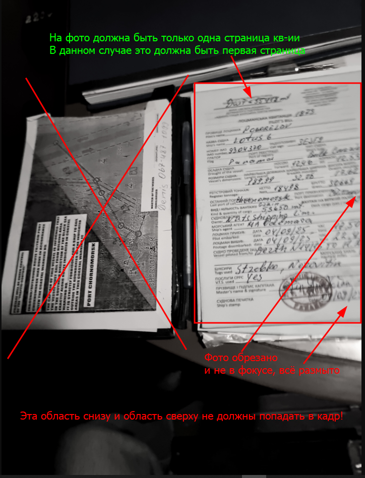
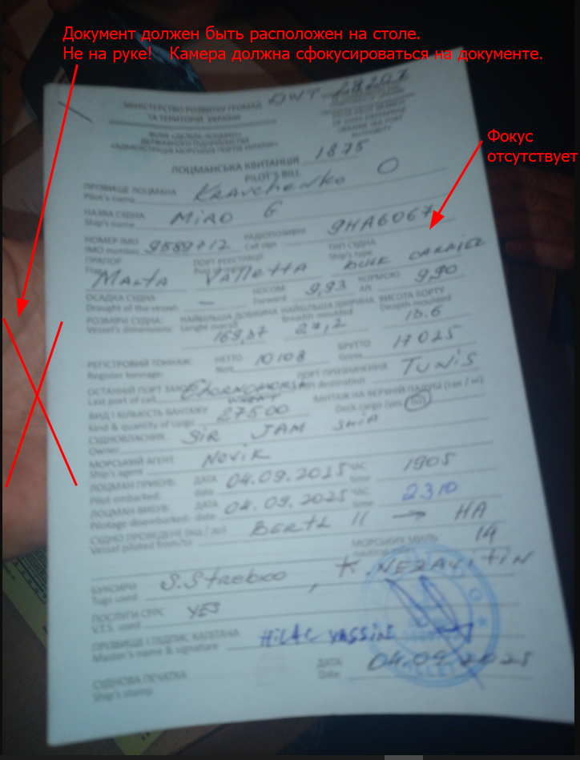

## Замечания
> В данном разделе собраны типичные ошибки при оформлении формы ввода квитанций ПЛС Черноморска
### 📸 Фото кв-ий
#### 1-ое фото = 1-ая стр
!!! note "**В первом блоке должна быть всегда загружена первая страница бумажной квитанции**"
    - При автоматизации печати реестра подгружаются фото **только из первого блока**
    - На данном этапе все так договорились
    - **Ниже пример неправильной загрузки**: `кв-ия № 2501871 ► MUSTAFA AFANDI`
    

---

#### 2 стр на одном фото
!!! note "**На фото должна быть только одна страница квитанции**"
    - Для первой страницы - фото должно быть в первом блоке
    - На фото не должно быть посторонних объектов (колени, стол, другие бумаги, зажимы и пр.)
    - Фото должно быть в фокусе, чтобы текст хорошо распознавался
    - **Ниже пример неправильной загрузки**: `кв-ия № 2501873 ► LOTUS 6`
    

---

#### Нет фокуса
!!! note "**Как сделать чёткое фото документа**"
    Чтобы фотография документа получилась качественной и в фокусе, следуйте простым правилам:
    - **Положите документ на ровную поверхность, например, на стол.** Это поможет избежать искажений и теней.
    - **Держите камеру прямо над документом**, не под углом.
    - **Перед съёмкой убедитесь, что камера сфокусировалась — дождитесь, пока изображение станет чётким на экране.** При необходимости коснитесь экрана в области текста, чтобы вручную навести фокус.
    - **Избегайте движения во время съёмки** — держите телефон устойчиво.
    - **Хорошее освещение — залог чёткого снимка.** Снимайте при дневном свете или включите лампу, чтобы избежать тёмных участков.
    - **Ниже пример фото не в фокусе**: `кв-ия № 2501875 ► MIRO G`
    

---
