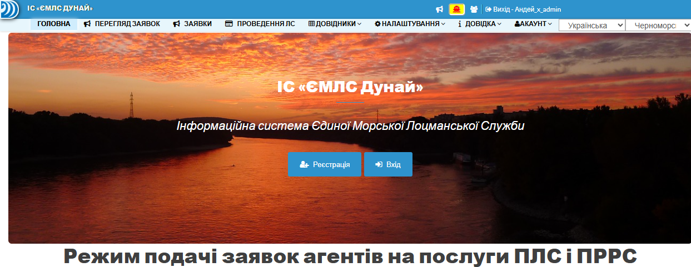

# **Введение**

**Добро пожаловать в документацию ИС «ЕМЛС Дунай» • «ПЛС Черноморск»**

## 📖 История развития ИС
!!! note "Хронологическая летопись развития ИС «ЕМЛС Дунай» • «ПЛС Черноморск»"
    - 📅 Начало в 2023 году: Прототипом для разработки стала информационная система **VTMIS Odessa**, на базе которой были выполнены постановка задачи, разработка технического задания и создание первых справочников и интерфейсов. 
    - 🧩 Каждый месяц — новые функции: регистрация пользователей, справочники судов, агентов, портов, квитанции, таймшиты, PDF-формы.
    - 🧠 Постепенно добавлялись роли: агент, диспетчер, лоцман, экономист — с индивидуальными кабинетами и правами.
    ---
    - 📅 В 2024 году   — акцент на аналитику, статистику, интеграции с внешними источниками (Equasis, Vessel Finder), Telegram-бот для уровней Дуная.
    - ⚙️ Внедрены сложные механизмы: распределение лоцманов, лидирование судов, контроль целостности данных, фильтры, графики, парсинг.
    ---  
    - 🧭 В 2025 году — акцент сместился на развитие ПЛС Черноморск: начата интеграция с **ИС VTMIS Odessa**, создана собственная логика заявок, справочников и проводок.
    - 🧩 Каждый месяц — новые функции: фильтры, кнопки, репликация данных, адаптация интерфейса под мобильные устройства, разработка новых режимов для лоцманов и диспетчеров.
    - 🔄 Внедрён переключатель регионов: пользователи могут работать с Дунайским и Черноморским направлениями в одном интерфейсе.
    - 📊 Статотчеты и Excel-выгрузки: реализованы отчёты по проводкам, занятости лоцманов, количеству работ по регионам, включая макросы и автоматическую генерацию.
    - 📱 Мобильная адаптация: переработан дизайн для Android и iOS, добавлены быстрые фильтры, ссылки на WhatsApp, логика авторизации по роли.
    - 📦 ПЕРЕГЛЯД ЗАЯВОК — новый режим для портовых ПЛС: самоназначение лоцманов, уведомления, фильтрация, переходы между заявками и проводками.
    - 🧠 Интеллектуализация процессов: автоматическое создание судов, расширенные справочники, контроль целостности данных, парсинг уровней Дуная и БОНИ.
    - 🚀 Август 2025 — старт опытной эксплуатации в ПЛС Черноморск, запуск интерактивной документации, подключение экономистов, финальная отладка интерфейсов.

!!! note "ℹ️ Примечание:"
    Ниже представлены тематические блоки, отражающие ключевые этапы развития системы — что, когда и зачем было реализовано. 
    История структурирована по годам, каждый из которых можно развернуть и подробно изучить по месяцам, прослеживая эволюцию идей, функций и решений. 
    Тут подробно отображено, как проект шаг за шагом превращался из идеи в полноценную цифровую платформу.

??? info "==**📅 2023 г.**== Старт разработки • Постановка ТЗ • Формализация бизнес логики • Внедрение"
    ### ==**2023 г.**== Постановка ТЗ • Бизнес логика • Внедрение 
    #### ==**Февраль 2023 г.**== 
        
    1. Устная постановка задачи
    2.  Предложения разработать сайт для **ИС ЕМЛС Дунай** по аналогии **ИС VTMIS Odessa** для подачи заявок агентов.
    
    ---

    #### ==**Март 2023 г.**==  
        
    3. Разработка ТЗ (21 стр.) 18 пунктов.
    4. Обозначены основные требования:
        
        - Должен быть прототипом существующей **ИС VTMIS Odessa**
        - Журнал заявок агентов
        - Справочники судов, агентов, портов, причалов
        - Журнал квитанций ЛС
        - Таймшит рабочего времени ЛС
    
    5. В ТЗ подробно расписаны функции со скриншотами по аналогии как сделано в **ИС VTMIS Odessa**
    
    ---

    #### ==**Апрель 2023 г.**== 
        
    6. **danube.pp.ua** - создан домен
    7. Разработан функционал регистрации на сайте с восстановлением паролей, активацией пользователей  
       
       - Разграничение прав доступа пользователей на сайте
       - Справочник пользователей
       - Справочник сотрудников
       - Отработка алгоритмов удаления и деактивации пользователей с проверкой целостности базы данных
       - Создание подробной видео инструкции пользователя на сайте
    
    ---

    #### ==**Май 2023 г.**==
        
    8. Справочник агентов
    9. Справочник городов
    10. Привязка пользователей сайта к агентским компаниям
    11. Отработка алгоритмов активации, деактивации и удаления пользователей и агентов с учетом наличия связанных таблиц в базе данных. Запрет на удаления пользователя при наличии связки с агентом или группой
    12. Справочник стран
        
       - На форме ввода привязка города к странам - взаимосвязанные списки  
    
    ---

    #### ==**Июнь 2023 г.**==
       
    13. Справочник ПРДС
    14. Справочник портопунктов - привязка к ПРДС
    15. Справочник причалов - привязка к портам - описание причалов
    16. Справочник Типов судов
    17. Справочник стран
    18. Справочник Типов сертификатов
    19. Справочник Судов - 10360 загружено из БД Планшет
    20. Суда - дубликаты
    21. Суда - Счетчики новых, дубликатов и с вопросами
    22. Ввод нового и редактирование
    23. Валидация ввода и проверка на дубликаты
    24. При вводе и удалении судна проверки на сохранение целостности базы данных
    25. Уведомления о регистрации новых пользователей
    
    ---

    #### ==**Июль 2023 г.**== 
        
    26. Создан новый режим: Журнал Заявок Агентов ЖЗА
    27. Режим администратора
    28. PDF - форма - Delta-pilot
    29. PDF - форма - DAVID - наказ Украины № 433 от 2020-07-31
    30. Редактирование/Отправка/Загрузка - Загрузка документов
    31. Статус заявки
    32. Список агентов
    33. Откуда - Куда. Дата откуда с уточнением
    34. Тип проводки
    35. Признак подтверждения заявки диспетчером ЛС
    36. Примечания диспетчера ЛС
    37. Назначение Лоцмана ПЛС
    38. Примечания агента
    39. Характеристики и параметры основного судна
    40. Характеристики и параметры второстепенных судов (караван/состав)
    41. Кабинет агента - каждый агент видит только свои заявки
    42. Кабинет агента - каждый агент видит только свои заявки
    43. Письмо с PDF заявкой
    44. Кабинет Диспетчера ЛС
    45. Глобальный счетчик-ссылка новых действующих заявок
    
    ---

    #### ==**Август 2023 г.**== 

    46. Первая версия режима **«Распределение лоцманов»** - встреча с пользователями! 
    47. Попытка опытной эксплуатации
    48. Сортировка по портам от устья реки Дунай
    49. Обязательные ПЯТЬ портов: Вилково,Килия,Измаил,Чатал,Рени
    50. Счетчики заявок в каждом портопункте
    51. Автоматическая подсветка лоцмана во всех заявках при наведении
    52. Список агентов
    53. Список перетаскиваемых лоцманов - Блок 2
    54. Инструмент для поиска лоцмана в блоке 2
    55. Инструмент для поиска лоцмана во всей таблице распределения лоцманов

    ---

    #### ==**Сентябрь 2023 г.**== 

    56. Распределение лоцманов - это задача диспетчеризации заявок - версия № 2
    57. Концепция и матмодель системы диспетчеризации заявок
    58. Графики работ лоцманов Измаил - 2 смены 10 через 10 ► Рени - 3 смены 3 через 6
    59. Автоматическое отображение текущих рабочих вахт и период дат с какой по какую дату
    60. Отпуска, больничные, состав вахт, лоцманы для перемещения
    61. Разбор конфликтных заявок 
    62. В ночное время - в конце вахты - желтый шрифт на темно синем фоне
    63. Командировка в Измаил
    64. Подготовка ТЗ для переработки второй версии распределения лоцманов

       - ТЗ для режима ввода лоцманских квитанций
       - Обсудили необходимость ввода заявок диспетчером ЛС
       - Обработка плана швартовых операций - привязка к ЖЗА и справочнику судов.

    ---

    #### ==**Октябрь 2023 г.**== 

    65. Ввод лоцманских квитанций - версия 1.0
    66. Авторизация лоцмана
    67. Два фильтра: Мои заявки и Мои кв-ии
    68. Состав каравана
    69. Редактирование квитанции
    70. Состав данных для ввода квитанции
    71. Список работ для лоцмана
    72. Ввод НОВОЙ заявки
    73. Взаимодействие с диспетчером ЛС
    74. Уточнение времени и статус заявки

    ---

    #### ==**Ноябрь 2023 г.**== 

    75. Ввод заявок диспетчером ЛС - версия 1.0
    76. Реализация по аналогии как вводит агент
    77. Работа со справочником судов - поддержание целостности данных
    78. Состав каравана
    79. Работа с фильтрами в таблице ЖЗА
    80. Загрузка дополнительных документов к заявке

    ---

    #### ==**Декабрь 2023 г.**== 

    81. Проводка судов методом лидирования - версия 1.0
    82. Поиск попутчиков
    83. Раскраска LM и LS
    84. Как отменить лидирование
    85. Работа с лоцманскими квитанциями и лоцманами
    86. Замена лидирующего судна
    87. Правила удаления квитанций
    88. Фильтры для лидирования
    89. Фильтр для контроля пропущенных квитанций

??? info "==**📅 2024 г.**== Финишиные доработки кабинета Лоцмана ПЛС • Статотчеты • Справочник судов • Уровни Дуная • Телеграм-бот  "
    ### ==**2024 г.**== Кабинет Лоцмана ПЛС • Статотчеты • СПР • Уровни Дуная • Телеграм-бот
    #### ==**Январь 2024 г.**== 

    1. Разработка информационной формы по судну в режиме заявок агентов и в списке квитанций ЛС - **версия 1.0**
    2. Состав данных для диспетчеров, экономистов и лоцманов отличается от агентов
    3. Разработка макетов дизайна формы для утверждения с диспетчерами ЛС
    
    ---
   
    #### ==**Февраль 2024 г.**== 

    1. Проводки ЛС Таймшит Форма ввода версия 3.0
    2. Даты СТАРТА и ФИНИША
    3. Даты из предыдущей и следующей проводок
    4. Тривалість відпочинку
    5. Обработка ошибок ввода и информирование пользователя с предупреждениями и запретами

    ---
   
    #### ==**Март 2024 г.**== 

    1. Уточнение времени в заявке диспетчером и агентом
    2. Режим Пользователи - исправлен фильтр
    3. ЖЗА - исправлены фильтры и списки лоцманов
    4. Распределение лоцманов - перестраиваем дизайн
    5. Загрузка фото проводок ЛС
    6. ЖЗА - фильтры для диспетчеров
    7. Распределение лоцманов - при перетаскивании меняем смены и больничный
    8. ЖЗА - для лоцманов ЛС свой дизайн и отображение режима
    9. ЖЗА - диспетчеры могут редактировать откуда - куда в заявке
    10. Проводки ЛС - история операций

    ---
   
    #### ==**Апрель 2024 г.**== 

    1. Исправление ошибок при вводе новой проводки
    2. ЖЗА - новое меню с фильтрами
    3. Кабинет лоцмана - кнопки
    4. Распределение лоцманов - перестраиваем дизайн  

        4.1. Счетчики, фильтры, фоны, цвета, отступы, сортировки лоцманов, судов и заявок и т.д.  
        4.2. Меняем логику работы со сменами - добавляем понятие временной смены при перетаскивании ломана не в свою смену  
        4.3. Отображение списка судов  
    
    5. PDF форма заявки - обновление списка отображаемых данных

    ---
   
    #### ==**Май 2024 г.**== 

    1. Справочник судов с привязкой к ЖЗА
    2. Инструмент для работы с ошибками ввода в заявках по данным судна
    3. В форме редактирования в справочнике судов разработан инструмент для быстрого корректирования данных судна по данным из заявки

    ---
   
    #### ==**Июнь 2024 г.**== 

    1. Формирование статистических отчетов **версия 1.0**
    2. Загальна статистика по морським портам
    3. Кількість робіт Дунайській регіон
    4. Проводки ЛС - печатная форма выбранного списка
    5. Отработка обратной связи с экономистами при работе с заявками - исправление ошибок
    6. Добавлен признак кто создал заявку: агент, диспетчер или экономист
    7. Для каждой группы пользователей сделан свой вариант фильтров для режима Проводки ЛС

    ---
   
    #### ==**Июль 2024 г.**== 

    1. Справочник судов. Парсинг регистров **EQUASIS •Vessel Finder • версия.3.0**
    2. В ЖЗА и в Проводках ЛС вывод предупреждения о несоответствии в данных по судну
    3. Расширенная форма редактирования судна с загрузкой данных из регистров, EQUASIS и Vessel Finder
    4. Убираем предупреждения при правильном вводе данных по судну

    ---
   
    #### ==**Август 2024 г.**== 

    1. Распределение лоцманов  
        
        1.1. Ввод и отображение уровней Дуная  
        1.2. Инфо-панель - убраны лишние данные  
    
    2. Справочник судов - добавлены парсинги с семи сайтов регистров судов
    3. Справочник причалов - пересчет расстояния от устья

    ---
   
    #### ==**Сентябрь 2024 г.**== 

    1. **Распределение лоцманов**  
        
        1.1. Автоматическое распознавание уровней с сайта гидрометеорологической лаборатории Дуная  
        1.3. Теперь можно не вводить руками  
        1.2. Отображение графиков уровней  
    
    2. **Создание ЧАТ-БОТа** для оповещения о появлении новых уровней и о новых БОНИ на сайте  

        2.1. Пересылка PDF файлов с уровнями и БОНИ по команде и автоматом  
        2.2. Активация бота, определение если участник покинул чат или отписался от рассылки  

    ---
   
    #### ==**Октябрь 2024 г.**== 

    1. Уровни Дуная - исправление ошибок парсинга  

        1.1. Исправлено отображение в архиве уровней  
        1.2. Исправлены ошибки при регистрации  

    2. Формула расчета миль - добавлена логика для Орловки  

        2.1. Исправлено формирование дистанции во всех отчетах, в колонтитулах фото проводок, в таблицах ЖЗА и Проводки ЛС  

    3. Изменился график смен в Рени - исправили алгоритм в распределении лоцманов
    4. Кабинет лоцмана - изменения в дизайне
    5. Справочник сотрудников - добавлено понятие подгруппы - переписан режим ввода и редактирования данных по сотруднику

    ---
   
    #### ==**Ноябрь 2024 г.**== 

    1. Проводки ЛС. Форма загрузки документов. Добавлено формирование превьюшек для JPG
    2. Исправлены ошибки в коде
    3. Лимит по созданию заявок 
    4. По умолчанию для всех 15 дней
    5. 30 - это лимит только для админов, диспетчеров и экономистов (и рени-порт)

??? info "==**📅 2025 г.**== Переключение внимания на разработку по Большой Одессе для **ПЛС Черноморска**  "
    ### ==**2025 г.**== Дунай. Статотчеты. ПЛС Черноморск
    #### ==**Январь 2025 г.**==

	1. Дунай. Режим Проводки ЛС
		
	2. Отчеты в Excel
			
		1. Добавляем Катер доставив • Катер зняв в отчет
		2. Номер кв-ии для Рени разделяем пробелом от трех первых цифр и следующих
		3. Проводки ЛС - отчеты -Все поля - Журнал проводок

	---

	#### ==**Февраль 2025 г.**==

	1. Отработка замечаний по квитанциям
	2. Разработка отчета по занятости лоцманов
	3. Отладка режима в Excel макросе
	4. Автоматическая генерация отчётов в отдельном режиме

	---

	#### ==**Март 2025 г.**==

	1. Парсинг БОНИ и уровней по Дунаю. Сайт метеорологической абсерватории поменял структуру и названия публикуемых документов

	---

	#### ==**Апрель 2025 г.**==

	1. Проводки ЛС - не грузилась фотка кв-ии
	2. **ПЛС Черноморск**
	3. Устная постановка ТЗ
	4. Задача минимум - репликация только Черноморских заявок из **ИС VTMIS Odessa**

	---

	#### ==**Май 2025 г.** ► **ПЛС Черноморск**==

	1. Справочник сотрудников - ЛОЦМАНЫ ПЛС
	2. Принадлежность к регионам. Лоцманы работали на Дунае, теперь вернулись в Черноморск
	3. Должен быть общий справочник
	4. Репликация справочников из **ИС VTMIS Odessa**: Агенты, Буксиров, Статусов заявок, Грузов, Типов судов, Причалов
	5. Админы и некторые Диспетчеры могут иметь доступ сразу к нескольким регионам
	6. Разработка нового режима ЖЗА специально для **ПЛС Черноморска**
	7. Автоматическое создание судна в БД Дуная из **ЖЗА ИC VTMIS Odessa**

	---

	#### ==**Май 2025 г.** ► **ЕМЛС Дунай**==

    1. График смен Измаил. С 2025-05-30 будет вместо 2-х смен три. 7 через 14
    2. Переписаны все режимы и справочники на сайте под новый график

	---

	#### ==**Июнь 2025 г.** ► **ПЛС Черноморск**==

	1. Редактирование в таблице ЖЗА
	2. ФИЛЬТРЫ в верху таблицы ЖЗА
	3. Кнопки над таблицей ЖЗА
	4. Сложный комбинированный фильтр
	5. Отладка репликации из **ИC VTMIS Odessa**
	6. Назначение лоцмана в заявку
	7. Адаптация ЖЗА под требования в порту Черноморск в соответствии с форматом заявок в **ИC VTMIS Odessa**
	8. Разработка нового режима по вводу Проводок ЛС для **ПЛС Черноморска**
	9. 

	---

	#### ==**Июнь 2025 г.** ► **ЕМЛС Дунай**==

    1. Исправление ошибок в коде после переформатирования алгоритмов по новому графику смен в мае 2025г.
    2. Справочник судов - исправлена ошибка копирования названия судна из ЖЗА в СПР
    3. Распределение лоцманов - была ошибка при смене статуса на В ПРОВОДКЕ
    4. При сохранении проводки была ошибка
    5. Добавлено дополнительное поле комментариев в ЖЗА
    6. И выделена отдельная колонка с комментариями только для агентов
    7. Переформатирована таблица ЖЗА (порядок колонок)
    8. Статотчеты: Кількість робіт Дунайській регіон - исправлен алгоритм учета лоцманов по регионам

	---

	#### ==**Июль 2025 г.** ► **ПЛС Черноморск**==

	1. Проводки ПЛС Черноморска - адаптация под использование в регионе Черноморск
	2. Весь функционал переформатирован и модернизирован
	3. Работа с печатным реестром квитанций
	4. Исправлена работа репликации из **ИC VTMIS Odessa**
	5. Выгрузка в Excel из режима Проводки ЛС (в том числе xls Отчет для Яни)
	6. Переключатель регионов - для админов и диспетчеров(не всех)
	7. Особенные фильтры для Черноморска в Проводках ЛС
	8. ЖЗА Черноморска - для Черноморских лоцманов добавлена логика при авторизации(открытии) на сайте
	9. Переформатирован дизайн мобильной версии для аккаунтов Лоцманов ЛС
	10. Черноморск - ПЕРЕГЛЯД ЗАЯВОК - создан НОВЫЙ режим
	11. Для портовых ПЛС ПЕРЕГЛЯД ЗАЯВОК переписан заново с учетом требований по портовым работам
	12. В ЖЗА Черноморска созданы свой набор быстрых фильтров
	13. Подготовка режимов на сайте для ввода в опытную эксплуатацию на ПЛС Черноморска
	14. Исправлены алгоритмы авторизации для диспетчеров(ст. смены)
	15. Адаптирован дизайн под различные девайсы (андроид, ноутбук, iOS)
	16. Добавлены все лоцманы и присвоены соответствующие смены, актуализированы контактные данные
	17. Проверена работа ссылок для отправки сообщений в WhatsApp
	18. ПЕРЕГЛЯД ЗАЯВОК - САМОназначение лоцманов - особенность портовых работ требует именно такую организацию процесса
	19. Добавлена возможность отправлять сообщение при перестановках в Перегляде заявок
	20. Добавлена отметка для привлечения внимания если лоцманы самостоятельно поменялись в заявке
	21. Разработан расширенный шаблон текста уведомления в WhatsApp с эмодзи и информацией о заявке и проводке
	22. Лоцманы должны сами менять статус на выполненная. Это можно сделать прямо в форме ввода проводки.
	23. В режиме `ЖЗА для ЛОЦМАНОВ` убраны верхние фильтры, т.к. лоцманы должны видеть и работать только со своими заявками.
	24. В ПЕРЕГЛЯДЕ ЗАЯВОК добавлена кнопка-ссылка на ЖЗА возле каждого названия судна (справа). Открывается ЖЗА с фильтром по этой заявке.
	25. В режиме ПЕРЕГЛЯД ЗАЯВОК в андроиде перестало работать меню(гамбургер) - FIXED

    ---

    #### ==**Август 2025 г.**== 
    
    1. Старт опытной экслуатации в **ПЛС Черноморск**
    2. Отработка замечаний
    3. В мобильной версии чтобы гамбургер не налазил на верхнуюю панель
    4. Передезайн логотипа(векторизация). Под различные браузеры, мессенджеры, девайсы
    5. Подключение лоцманов
    6. Актуализация справочника причалов и справочника буксиров
    7. ЖЗА ► Аккаунт ЛОЦМАНА ПЛС - таблица заявок открывается без правильно настроенных колонок
    8. Если сделан переход из ПЕРЕГЛЯДА ЗАЯВОК по кнопке ЖЗА, то переставали работать фильтры
    9. Перестройка элементов управления в ЖЗА для более компактного и функционального отображения
    10. Добавляем экономиста в Черноморск
    11. Для группы пользователей `экономисты` открываем доступ к режимам ЖЗА и Проводки ЛС
    12. Пофиксили баг при загрузке документов(фото квитанций). Обнаружилось на девайсах лоцманов.
    13. **Проводки ЛС** - Реализован функционал для ПЛС Черноморска такой же как на Дунае - [см. Реестр кв-ий](reestr) 
    14. В Проводках ЛС исправлено отображение Черноморских смен
    15. Формализация работы со сменой статуса при редактировании Проводки ЛС - [см. Алгоритм смены статусов](ilk_001_main) - `Пока не реализован!`
    16. Создана интерактивная документация ИС «ЕМЛС Дунай» • «ПЛС Черноморск»
    17. Замечания экномистов ПРДС Одесса
    18. Выгрузка реестра печати с первыми фото квитанций в PDF файл [см. инструкцию 🖼️ PDF реестр с фото](reestr#pdf) 
    19. Фильтр и сортировка в Проводках ЛС по номеру кв-ий и датам ПРИБЫЛ и УБЫЛ [см. инструкцию ↕️ Сортировка и фильтры](reestr_001_filter_sort.md) 

    ---

    #### ==**Сентябрь 2025 г.**== 
    
    1. **Статотчеты ПЛС-Черноморск** ► **Звіт - Проведення лоцмана за місяць**
    2. **Для пользователей в регионе Черноморск для групп (экономисты, экономисты-просмотр, диспетчеры и админы) открыт доступ к режимам генерации статотчетов**
    3. Выпадающий список выбора региона перенесен вниз над формой статистики: **«Звіт - Проведення лоцмана за місяць»**
    4. В документации добавлен раздел Статотчеты ► [Проведення лоцмана за місяць](reports/report_02_pilot_one_month.md) 
    5. В документации добавлен раздел Проводки ЛС ► [⚠️ Замечания - Решаем задачу повышения качества фотографируемых лоцманских квитанций](ilk_prov_err_001_photo.md)
    6. **БОНИ и УРОВНИ**. Опять поменялся формат даты в PDF. Доработан алгоритм парсинга - FIXED
    7. **Подсчет дистанции от Чатал ► 49 мили до  Быстрого** Неправильно считает - должно быть в сумме 71 миля - ошибка тянулась с 2024-07-18
    8. Исправлена логика репликации из ИС VTMIS Odessa - копируются все заявки кроме не отправленных
    9. 📊 ►  Звіт - Кількість робіт Дунайській регіон / ПЛС Чорноморськ [см. инструкцию](reports/report_03_prov_pilot_month.md) 
    10. Звіт - Загальна статистика по морським портам - Добавлен ПЛС Чорноморськ
    11. Отработка замечаний по статотчетам. Исправлены скриншоты в документации.
    12. **Создан новый режим: 📸 Скан.** В данном режиме лоцману достаточно навести камеру на документ и поместить его в рамку и нажать кнопку обрезать
    13. В документации добавлен раздел Проводки ЛС ► [📸 Скан ](instr_video_08_scan_photo.md)

