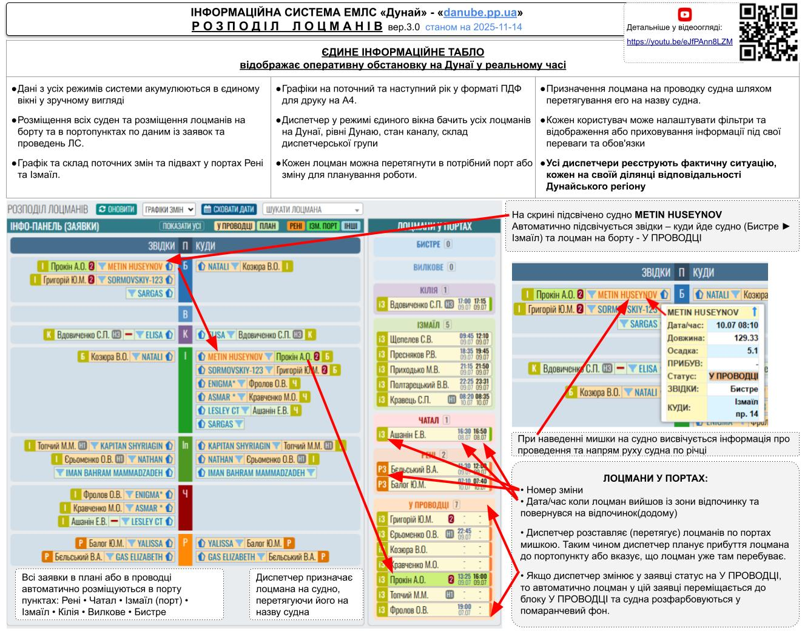

==**2025-07-10**== ◄ `дата публикации`
<iframe width="500" height="515" src="https://www.youtube.com/embed/eJfPAnn8LZM" frameborder="0" allowfullscreen></iframe>

✅ **Инструкция : РОЗПОДІЛ ЛОЦМАНІВ • v.3.0**

► В этом видео изучим работу диспетчирезации очереди заявок агентов и более подробно расскажем как работает распределение лоцманов на заявленные проводки.

► Основная задача диспетчирезации на реке - это правильно распределить лоцманов по пути следования заявленных судов.
соответствии с графиком смен лоцманов, учитывает наличие подвахт, система автоматически отслеживает когда лоцман покинул зону отдыха и когда он освободился.  

 

