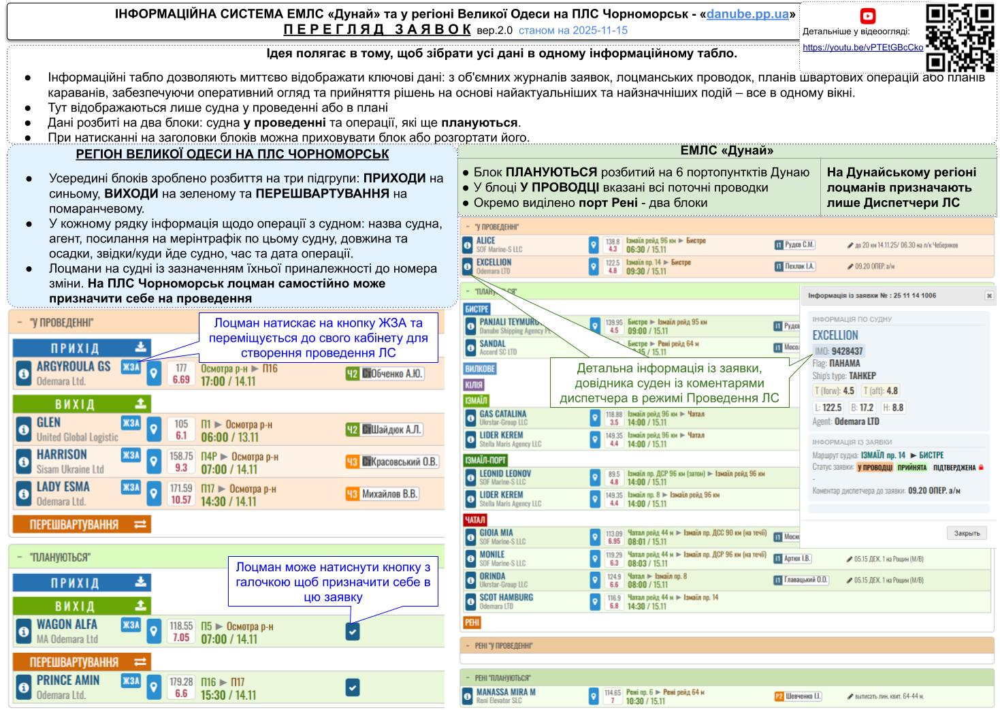

==**2025-07-20**== ◄ `дата публикации`
## [Инструкция на сайте danube.pp.ua](https://www.danube.pp.ua/instr_video_09_pereglyad)
<iframe width="500" height="515" src="https://www.youtube.com/embed/vPTEtGBcCko" frameborder="0" allowfullscreen></iframe>

✅ **Инструкция : ПЕРЕГЛЯД ЗАЯВОК • v.2.0**

► В этом видео изучим работу нового режима ПРОСМОТР ЗАЯВОК.

► Идея заключается в том, чтобы собрать все данные в одном информационном табло.

► Информационные табло позволяют мгновенно отображать ключевые данные из объемных журналов заявок, лоцманских проводок, планов швартовых операций или планов караванов, обеспечивая оперативный обзор и принятие решений на основе самых актуальных и значимых событий — всё в одном окне.

► Здесь отображаются только суда в проводке или в плане.

► Наши данные разбиты на два блока: суда в проводке и операции, которые ещё планируются.

 

