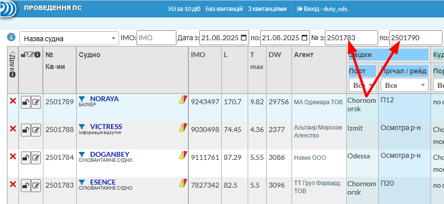
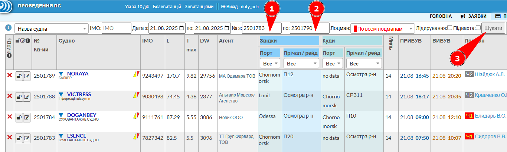
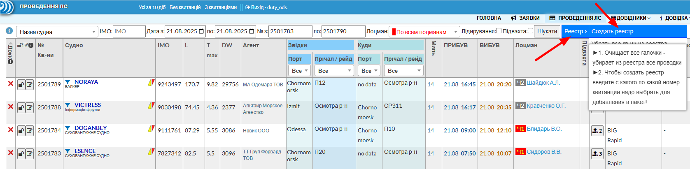
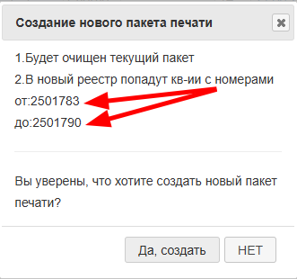
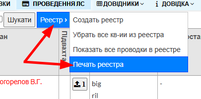
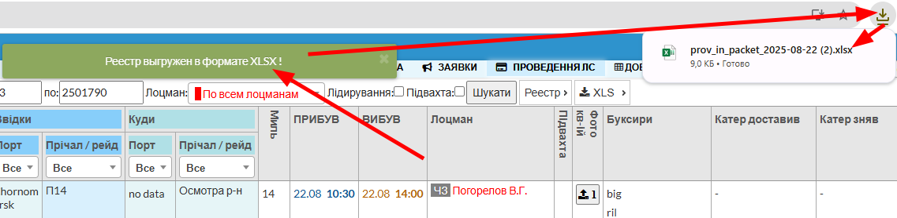
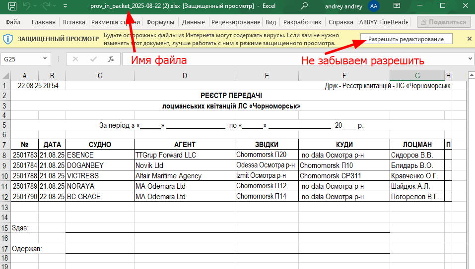
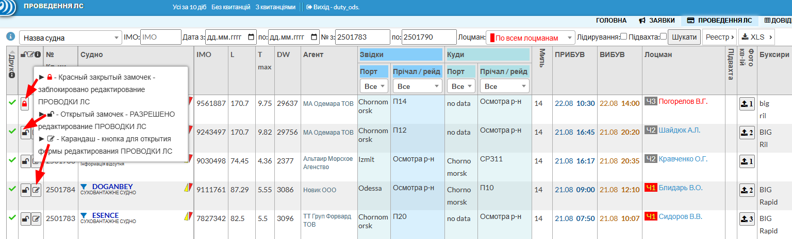
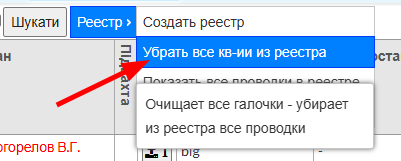

## 🗂️ Реестр кв-ий
📅 2025-08-22 Реализован функционал для ПЛС Черноморска такой же как на Дунае

---

## 🗂️ Создание реестра
### 🔢 Шаг 1: Укажите диапазон квитанций 
Введите **начальный и конечный номера квитанций** для формирования реестра.
  

---

### 🔍 Шаг 2: Проверьте список 
Нажмите на кнопку **« Шукати »**, чтобы отобразить список квитанций.  
  
---

### 🧾 Шаг 3: Создайте реестр  
Выберите в меню **«Реестр → Создать реестр»**.  
> ⚠️ При создании нового реестра **все галочки из предыдущего пакета будут сняты**.  

---

### 📋 Шаг 4: Подтвердите создание  
В диалоговом окне **«Создание нового пакета печати»** проверьте номера квитанций.  
Нажмите **«Да, создать»**, если всё верно.  

---

### ✅ Шаг 5: Проверка пакета  
Появится сообщение:  
**Квитанции в пакет печати добавлены**  
В таблице отобразятся только квитанции с **✅ зелёными галочками**.  

---

### 🖨️ Шаг 6: Печать реестра  
Выберите в меню **«Реестр → Печать реестра»**  

---

### 📥 Шаг 7: Скачивание файла  
Появится сообщение:  
**Реестр выгружен в формате XLSX!**  
Файл автоматически скачан в загрузки.  

---

### 📂 Шаг 8: Откройте файл  
Откройте файл `prov_in_packet_2025-08-22.xlsx` из папки загрузок.  

---

## 🔒 Блокировка редактирования Проводок ЛС

Чтобы запретить изменения в квитанции:  
- В таблице **Проводок ЛС** нажмите на значок **замочка** напротив нужной квитанции.  
- Замочек должен стать 🔒 **закрытым красным**.  
- **На Дунае замочками отмечают проводки, которые уже проверены и распечатаны.**  

---

## 🧹 Очистка реестра

Чтобы очистить реестр:  
- Выберите в меню **«Реестр → Убрать все кв-ии из реестра»**  
