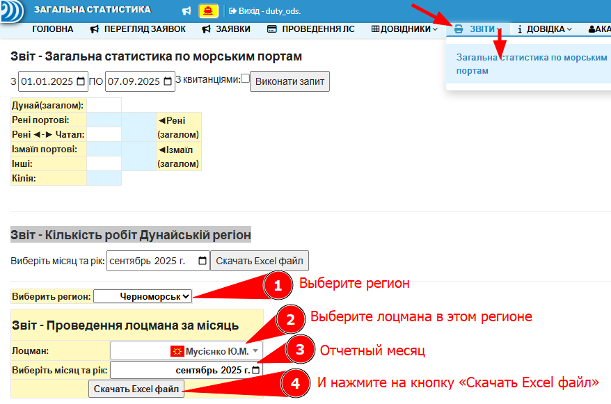
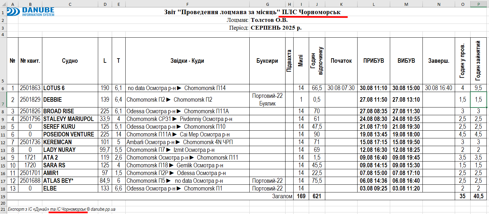

!!! note "Страница отчетов общая для двух регионов:"
    - Вверху два отчета:
      - Звіт - **Загальна статистика по морським портам**
      - Звіт - **Кількість робіт Дунайській регіон / ПЛС Чорноморськ**
    - **Звіт - Проведення лоцмана за місяць** работает по выбранному региону и лоцману
    - Необходимо выбрать месяц и нажать на кнопку **«Скачать Excel файл»**
    

---

!!! note "Файл Excel выглядит почти также как на Дунае"
    - В заголовке для Черноморска добавлено **ПЛС Чорноморськ**:
    - И под таблицей:  *та ІС Чорноморськ*
    
    
---
