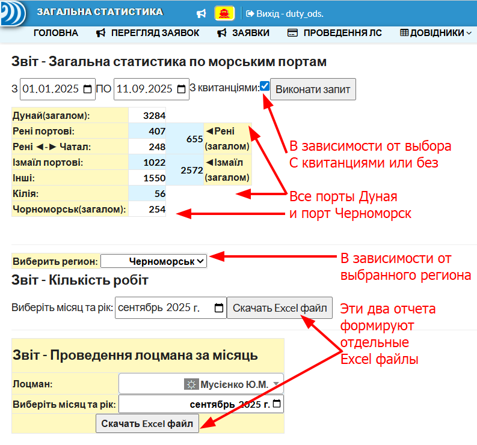

!!! note "Страница отчетов общая для двух регионов:"
    - Звіт - **Загальна статистика по морським портам ТОЛЬКО ДУНАЯ**
    - Далее два отчета, которые можно генерировать по выбранному региону
      - Звіт - **Кількість робіт Дунайській регіон ИЛИ ПЛС ЧОРНОМОРСЬК**
      - **Звіт - Проведення лоцмана за місяць** работает по выбранному региону и лоцману
    

---

!!! note "Файл Excel по Дунаю не менялся, а по Черноморску - другой вид"
    - Изменен заголовок и оставлена только одна таблица
    
---
