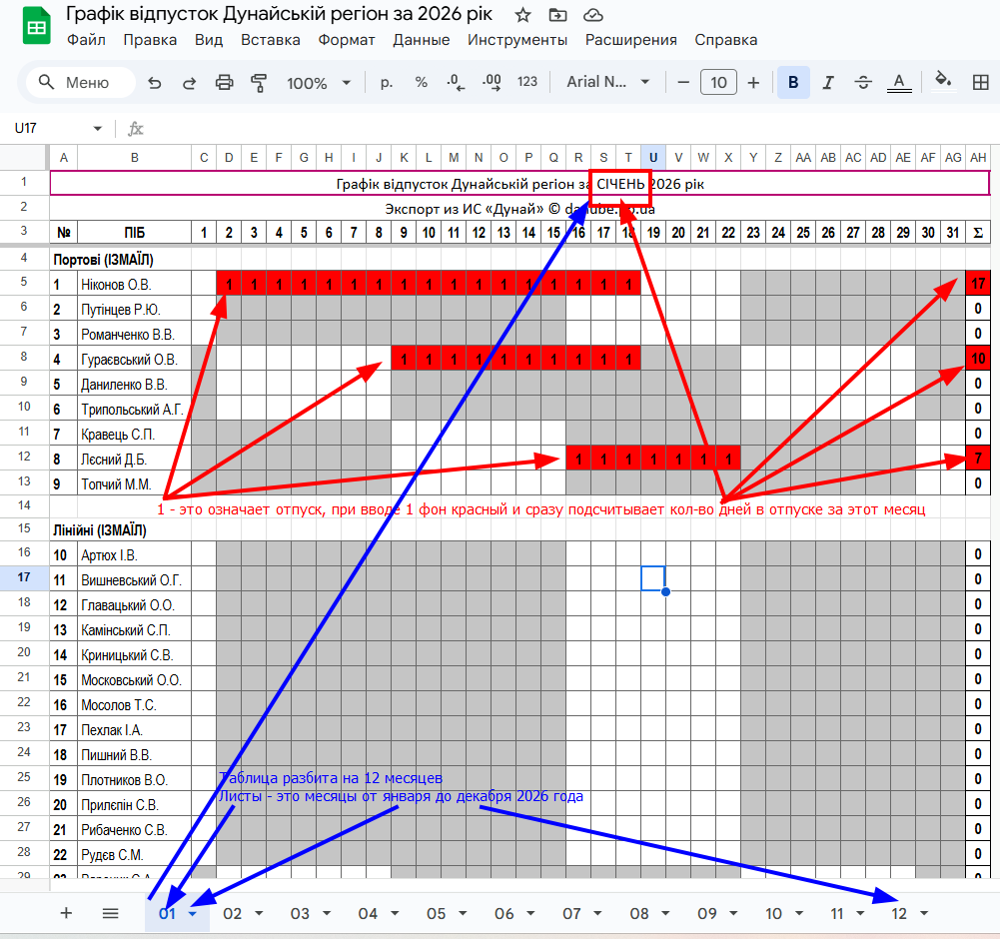

!!! note "График отпусков по региону Дунай на 2026 год"
    - Это гугл таблица. Каждый лист это один месяц. В таблице 12 листов
    - В каждом месяце все лоцманы могут работать одновременно, отмечая дни в которые они планируют пойти в отпуск
      - Если ввести единицу в ячейке, то ее фон будет раскрашен в красный цвет и кол-во дней в этом месяце будет автоматически расчитано
    

---